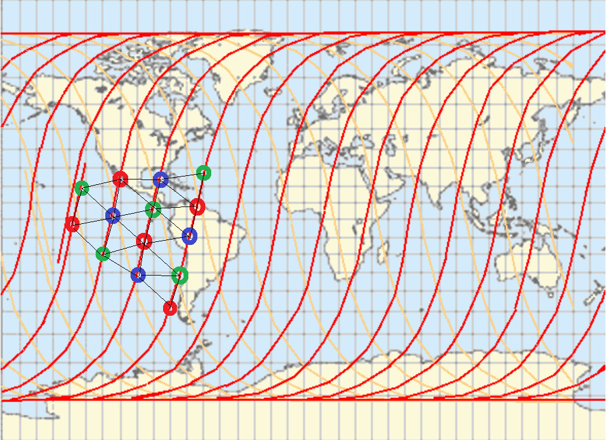

## Скрипт по раскраске графа и назначению частот для связи с Землей

Прилагаемый код *t1.m* находит раскраску для пяти красок для неподвижных
спутников из прилагаемых конфигураций.

В соответствии с известной теоремой о четырех красках,
для любой неподвижной конфигурации спутников
задача раскраски должна решаться для четырех красок.
Более того, для триангуляции Делоне  при регулярном расположении спутников существует очевидное решение с тремя красками (показано на рисунке).

Однако, для движущихся спутников, каковыми они в реальности и являются, граф перестает быть планарным. Отмеченные на рисунке спутники движутся с юго-запада на северо-восток (назовем это движение "восходящим"). Они сохраняют смежность между собой, но постоянно пересекают пути новых соседей, спутников, движущихся с северо-запада на юго-восток (по "нисходящему" участку траектории). Учет как "восходящих", так и "нисходящих" спутников нарушает однородность триангуляции.

 Предлагается следующее решение с минимальным количеством переключений частот для каждого спутника. Общее количество частот равно шести. Три для "восходящего" и три для "нисходящего" движения спутника. Назначение частот - как показано на рисунке для "восходящего" участка. Для "нисходящего" - аналогично. Переключение частоты для каждого спутника происходит два раза за период, в моменты наибольшего приближения к полюсам Земли.
 
 Следует заметить, что высота (и период обращения) всех спутников предполагался одинаковым. При наличии нескольких группировок на различных высотах следует назначать независимые группы частот для каждой группировки. 